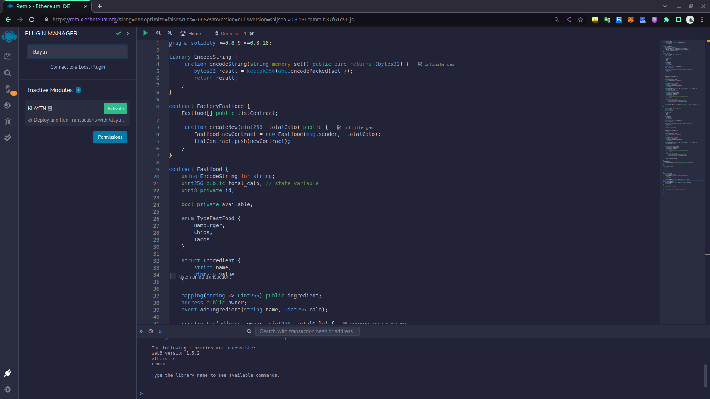
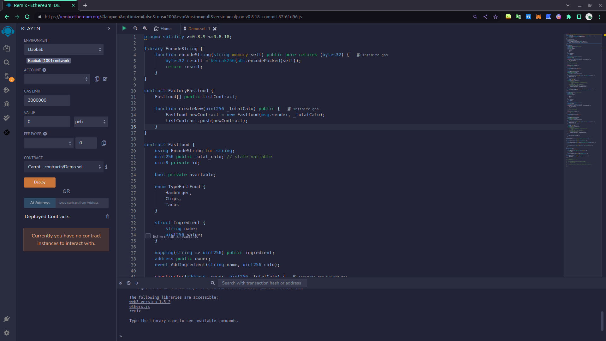
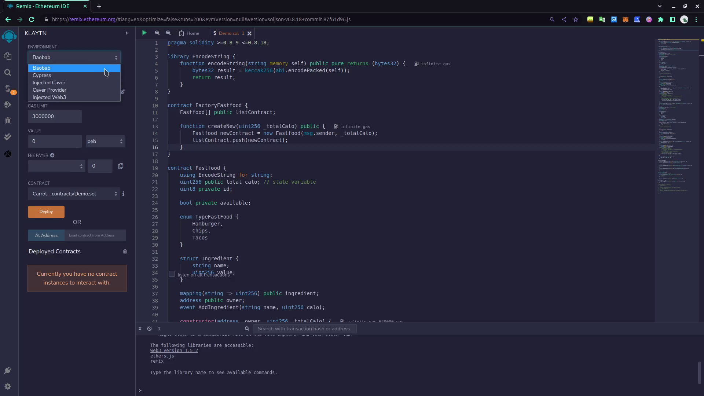
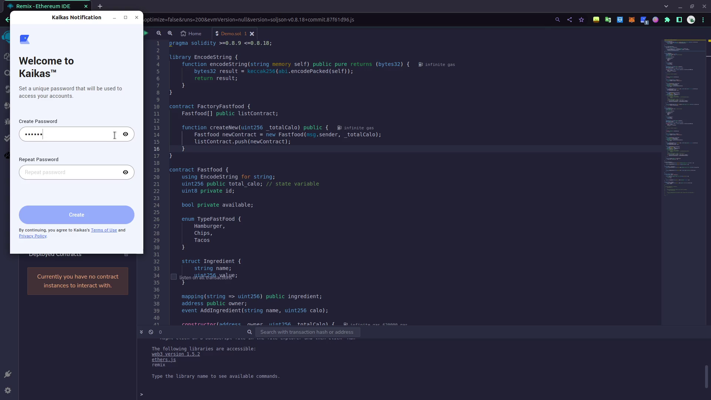
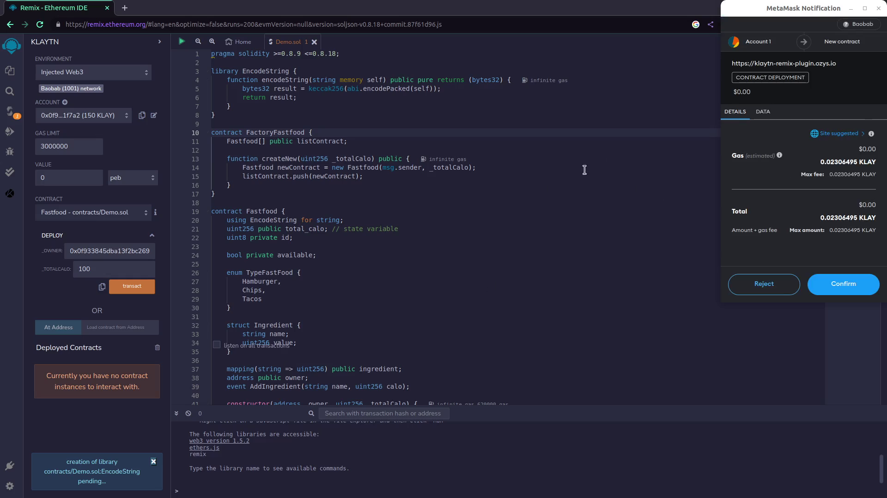
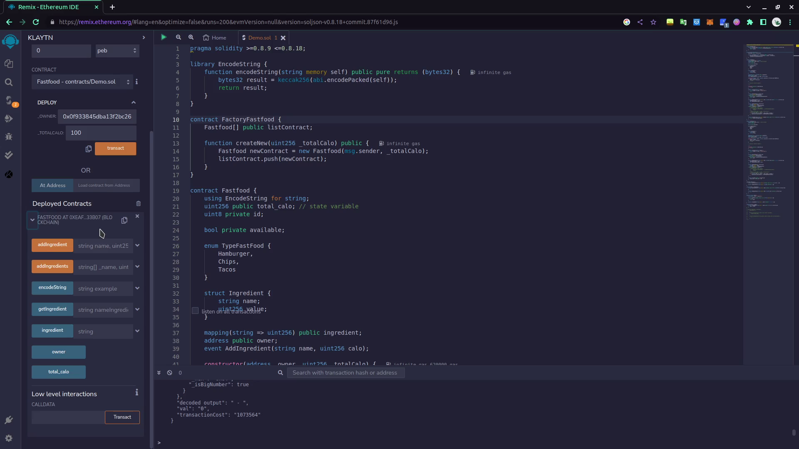

# Các bước triển khai SC lên mạng testnet/mainnet

1. Vào phần **Plugin** cuối góc màn hình bên trái và tìm kiếm **Klaytn**. Chọn **Activate**

2. Chọn plugin **Klaytn** đã tải về ở cột góc trái của Remix.

3. Chọn **Environment**. Nếu muốn chọn mạng Testnet thì sử dụng mạng **Baobab**, còn mạng Mainnet sẽ là Klaytn
> Có 2 loại mạng Testnet và Mainnet; Testnet để  chạy test các ứng dụng trước khi đẩy lên mạng Mainnet thật sự. Sử dụng Testnet trước khi đẩy lên mainnet sẽ giúp các nhà phát triển tiết kiệm chi phí và đảm bảo vận hành. 

4. Tùy vào loại ví bạn sử dụng thì sử dụng **Environment** theo đó. Ví dụ **Metamask** thì chọn **InjectedWeb3**, **Kaikas** thì chọn **InjectedCaver**

.png)

5. Chọn Contract muốn triển khai lên mạng và điền các tham số đầu vào tương ứng. Sau đó sẽ tùy thuộc vào loại ví sử dụng mà sẽ có popup xuất hiện yêu cầu xác nhận giao dịch. Chọn **Confirm**

6. Sau khi thực hiện xong giao dịch sẽ hiện contract phía dưới. Có thể thực hiện tương tác với SC trên giao diện của Remix

